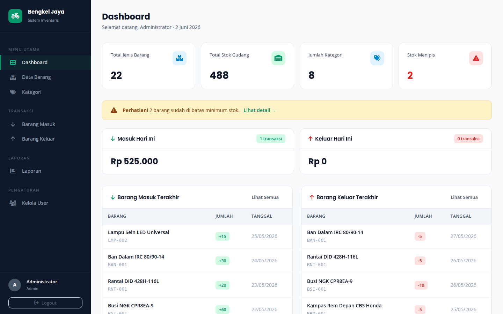

<div align="center">

# 🔧 Bengkel Jaya — Sistem Inventaris Spare Part Motor

**Manajemen persediaan spare part sepeda motor berbasis web untuk bengkel kecil-menengah.**


[Features](#fitur) · [Install](#cara-install) · [Login](#login) · [Struktur](#struktur-proyek) · [License](#license)

</div>

---

## Preview



> Dashboard utama — ringkasan stok, grafik penjualan bulanan, distribusi per kategori, dan peringatan stok menipis.

---

## Fitur

### 📦 Data & Master
| Modul | Deskripsi |
|-------|-----------|
| **Dashboard** | Ringkasan stok, transaksi hari ini, grafik Chart.js (line + doughnut), alert stok menipis |
| **Data Barang** | CRUD spare part — kode, kategori, satuan, stok, harga beli/jual, lokasi rak, riwayat harga |
| **Kategori** | Kelola kategori barang (Oli, Kampas Rem, Ban, Busi, Rantai, Filter, Lampu, Komponen Mesin) |
| **Supplier** | Master data supplier — nama, alamat, telepon, email, kontak person |

### 🔄 Transaksi
| Modul | Deskripsi |
|-------|-----------|
| **Barang Masuk** | Catat penerimaan barang dari supplier, auto-update stok, dropdown supplier |
| **Barang Keluar** | Catat pengeluaran barang ke bengkel, validasi stok tersedia |
| **Stock Opname** | Hitung fisik vs sistem, catat selisih, resolve (update stok ke nilai fisik) |

### 📊 Laporan & Export
| Modul | Deskripsi |
|-------|-----------|
| **Laporan** | Statistik per bulan/kategori, detail transaksi masuk & keluar, barang paling sering keluar |
| **Export Excel** | Download data dalam format CSV (bisa dibuka Excel, Google Sheets, LibreOffice) |
| **Export PDF** | Generate PDF langsung dari server (MiniPDF, zero dependency) |
| **Print** | Cetak langsung dengan layout yang sudah dioptimasi untuk kertas |

### ⚙️ Pengaturan
| Modul | Deskripsi |
|-------|-----------|
| **Kelola User** | Manajemen akun admin & operator (admin only) |
| **Log Aktivitas** | Audit trail — siapa, kapan, aksi apa, data lama vs baru (admin only) |

### 🎨 UI/UX
| Fitur | Deskripsi |
|-------|-----------|
| **Global Search** | Cari barang dari halaman manapun via search bar di header |
| **Notifikasi Stok** | Badge merah di sidebar menandakan jumlah barang stok menipis |
| **Validasi Form** | Client-side validation sebelum submit (required, numeric, tanggal) |
| **Modal Konfirmasi** | Dialog hapus modern menggantikan `confirm()` bawaan browser |
| **Loading Spinner** | Overlay "Menyimpan..." + disable tombol untuk mencegah double-submit |

---

## Tech Stack

| Layer | Teknologi |
|-------|-----------|
| Backend | PHP 8.x, PDO (MySQL) |
| Database | MySQL 8.x |
| Frontend | HTML5, CSS3 (Design System 2026), Vanilla JS |
| Charts | Chart.js 4.x |
| PDF | MiniPDF — custom PHP PDF generator, zero dependency |
| Icons | Font Awesome 6.5 |
| Fonts | Poppins (heading) + Open Sans (body) |

---

## Cara Install

### Prasyarat

- **PHP** 8.0 atau lebih baru
- **MySQL** 8.0 atau lebih baru (atau MariaDB 10.4+)
- **Web server** — XAMPP, Laragon, atau `php -S` built-in server

### Langkah 1 — Buat Database

Buka phpMyAdmin atau terminal MySQL, lalu buat database:

```sql
CREATE DATABASE inventory_sparepart CHARACTER SET utf8mb4 COLLATE utf8mb4_unicode_ci;
```

### Langkah 2 — Import Schema Utama

**phpMyAdmin:** Import → pilih file `database.sql`

**Terminal:**
```bash
mysql -u root -p inventory_sparepart < database.sql
```

### Langkah 3 — Import Fitur Tambahan

File ini menambahkan tabel `supplier`, `audit_log`, `stok_opname`, `harga_history`, dan kolom `supplier_id`.

**phpMyAdmin:** Import → pilih file `database_migration.sql`

**Terminal:**
```bash
mysql -u root -p inventory_sparepart < database_migration.sql
```

### Langkah 4 — Konfigurasi Koneksi

Edit file `config/database.php`, sesuaikan dengan credentials MySQL kamu:

```php
$host = 'localhost';        // ganti jika pakai remote DB
$dbname = 'inventory_sparepart';
$username = 'root';         // sesuaikan
$password = '';             // sesuaikan
```

### Langkah 5 — Jalankan

**XAMPP/Laragon:** Letakkan folder proyek di `htdocs/` atau `www/`, buka `http://localhost/inventory-sparepart/`

**Built-in server:**
```bash
cd inventory-sparepart
php -S localhost:8000
```

Buka `http://localhost:8000` di browser.

---

## Login

| Role | Username | Password | Akses |
|------|----------|----------|-------|
| **Admin** | `admin` | `password` | Semua fitur + kelola user + audit log |
| **Operator** | `operator1` | `password` | Transaksi + laporan (tidak bisa kelola user) |

> ⚠️ Ganti password setelah login pertama kali untuk keamanan.

---

## Struktur Proyek

```
inventory-sparepart/
│
├── config/
│   └── database.php              # Koneksi PDO, helper functions, audit log
│
├── includes/
│   ├── header.php                 # HTML head, CSS, Chart.js, JS global
│   └── sidebar.php                # Navigasi sidebar + badge notifikasi stok
│
├── assets/
│   ├── css/
│   │   └── style.css              # Design system (CSS variables, komponen)
│   ├── js/
│   │   ├── app.js                 # Global search, delete modal, loading states
│   │   └── validation.js          # Form validation (required, numeric, date)
│   └── img/
│       └── dashboard.png          # Screenshot dashboard
│
├── lib/
│   └── minipdf.php                # PDF generator (zero dependency, 662 baris)
│
├── index.php                      # Halaman login
├── dashboard.php                  # Dashboard + Chart.js
├── barang.php                     # CRUD barang + riwayat harga
├── kategori.php                   # CRUD kategori
├── supplier.php                   # CRUD supplier
├── masuk.php                      # Transaksi barang masuk
├── keluar.php                     # Transaksi barang keluar
├── opname.php                     # Stock opname
├── laporan.php                    # Laporan + detail transaksi + export
├── export.php                     # Export CSV / PDF / Print
├── log.php                        # Audit log (admin only)
├── search_api.php                 # API pencarian barang (JSON)
├── api_harga_history.php          # API riwayat harga (HTML fragment)
├── users.php                      # Kelola user (admin only)
├── logout.php                     # Logout
│
├── database.sql                   # Schema + data awal (25 barang, 8 kategori, 5 supplier)
├── database_migration.sql         # Tabel tambahan (supplier, audit, opname, harga)
└── README.md
```

---

## Database Schema

### Tabel Utama (database.sql)

| Tabel | Fungsi | Kolom Utama |
|-------|--------|-------------|
| `users` | Akun pengguna | username, password (bcrypt), role (admin/operator) |
| `kategori` | Kategori barang | nama_kategori, deskripsi |
| `barang` | Data spare part | kode_barang, nama_barang, stok, stok_minimum, harga_beli, harga_jual |
| `barang_masuk` | Transaksi masuk | no_transaksi, barang_id, jumlah, harga_satuan, tanggal_masuk, supplier |
| `barang_keluar` | Transaksi keluar | no_transaksi, barang_id, jumlah, harga_satuan, tanggal_keluar, tujuan, penerima |

### Tabel Tambahan (database_migration.sql)

| Tabel | Fungsi |
|-------|--------|
| `supplier` | Master data supplier |
| `audit_log` | Log semua aksi CRUD (create/update/delete) |
| `stok_opname` | Header stock opname (tanggal, status) |
| `stok_opname_detail` | Detail per barang (stok_sistem, stok_fisik, selisih) |
| `harga_history` | Riwayat perubahan harga beli/jual |

---

## Data Sampel

Proyek sudah include data awal supaya bisa langsung dicoba:

- **25** jenis spare part (Oli Mesin, Kampas Rem, Ban Dalam, Busi NGK, Rantai, Filter Udara, dll)
- **8** kategori
- **5** supplier
- **6** transaksi masuk
- **5** transaksi keluar

---

## Rumus Stok

| Konsep | Rumus |
|--------|-------|
| Stok Minimum | Batas peringatan stok menipis (per barang) |
| Nilai Stok | `stok × harga beli` |
| Status Normal | `stok > stok_minimum` |
| Status Menipis | `stok ≤ stok_minimum` |
| Status Habis | `stok = 0` |
| Selisih Opname | `stok_fisik − stok_sistem` |

---

## License

MIT — bebas digunakan, dimodifikasi, dan didistribusikan.

---

<div align="center">

**Bengkel Jaya** — Sistem Inventaris Spare Part Motor

Dibuat dengan PHP, MySQL, dan sedikit cinta untuk bengkel Indonesia. 🏍️

</div>
